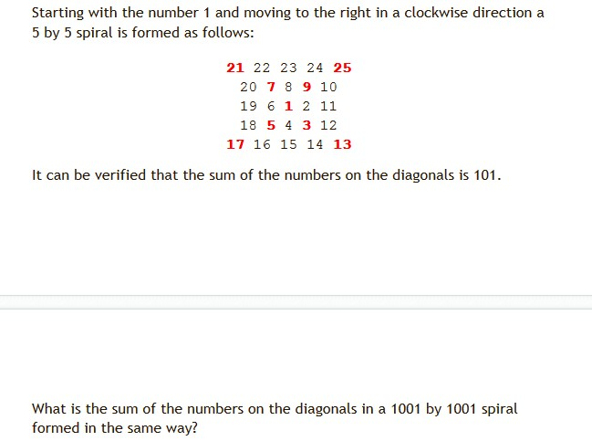

#基础篇(1)
>1. 打印出所有的 "水仙花数 "，所谓 "水仙花数 "是指一个三位数，其各位数字立方和等于该数本身。
>>
~~~
例如:153是一个 "水仙花数 "，因为153=1的三次方＋5的三次方＋3的三次方。
~~~
 

>2. 一个数如果恰好等于它的因子之和，这个数就称为 "完数 "。例如:6=1＋2＋3.编程   找出1000以内的所有完数。  

>3. 一个5位数，判断它是不是回文数。即12321是回文数，个位与万位相同，十位与千位相同  

>4. 给一个不多于5位的正整数，要求：一、求它是几位数，二、逆序打印出各位数字  

>5. 输入某年某月某日，判断这一天是这一年的第几天  

>6. 打印出如下图案（ 半个菱形）   
		*    
		***    
		******   
		********    
		******    
		***    
		*  
  

>7. 求s=a+aa+aaa+aaaa+aa...a的值，其中a是一个数字
>>
~~~
例如:2+22+222+2222+22222(此时共有5个数相加)，几个数相加由键盘控制
~~~
  

>8. 读入一个自然数n，计算其各位数字之和，用汉语拼音写出和的每一位数字  

>9. 本题要求计算 A/B，其中 A 是不超过 1000 位的正整数，B 是 1 位正整数。你需要输出商数 Q 和余数 R，使得 A=B×Q+R 成立。
>>
~~~
输入格式：
输入在一行中依次给出 A 和 B，中间以 1 空格分隔。
输出格式：
在一行中依次输出 Q 和 R，中间以 1 空格分隔。
输入样例：
123456789050987654321 7
输出样例：
17636684150141093474 3
~~~
  

>10. 计算边角值
>>
  
