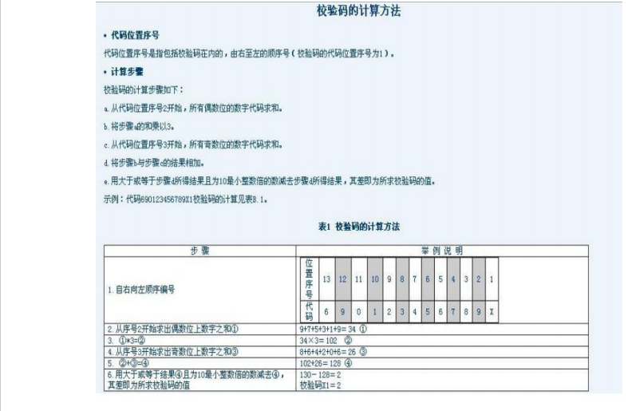

#基础篇(2)
>1. 数组排重(至少使用两种方式实现)  

>2. 随机打乱数组[do not use any java.util.*]   

>3. 仅用1个for循环来实现九九乘法表的输出  

>4. 求出两个数的最大公约数和最小公倍数  

>5. 输出1-200之间所有的素数,并且每7个换一行  

>6. 验证条形码
>>
  

>7. Given a String,for example,"{[()]}",write a program to check if all brackets
      in the string are matched to each other or not.Match means,for example,
      in "{}"or"[]"or"{}"it is matched,but"{[}]"are NOT matched.please don't use
      any utility classes from java.util package.Please also write a unit test use
      following string as input to test this method "([{()}])"

>8. 写一个程序,遍历出某个目录下的所有内容[子目录名称以及子文件的绝对路径.]  

>9. 写一个程序,实现目录的拷贝  

>10. 写一个程序,实现目录的删除